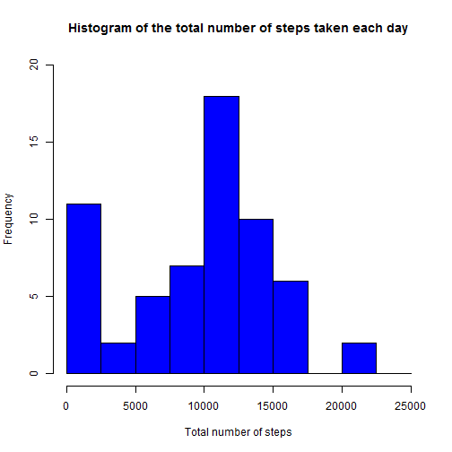
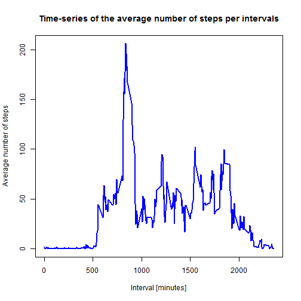
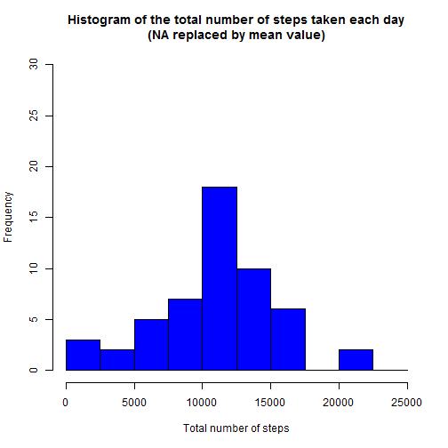
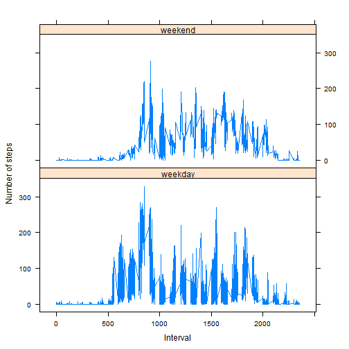

#Course Project 1  

##Processing Raw Data  
```r
library(knitr)
opts_chunk$set(echo = TRUE, results = 'hold')
```

### Clear the workspace
```r
rm(list=ls())
```

### Load the raw activity data
```r
activity_raw <- read.csv("C:/Users/Justin/Documents/peer_assesment_1/activity.csv", colClasses = c("numeric", "character","numeric"))
```

### Transform the date attribute to an actual date format
```r
activity_raw$date <- as.POSIXct(activity_raw$date, format="%Y-%m-%d")
```

### Compute the weekdays from the date attribute
```r
activity_raw <- data.frame(date=activity_raw$date, 
                           weekday=tolower(weekdays(activity_raw$date)), 
                           steps=activity_raw$steps, 
                           interval=activity_raw$interval)
```

### Compute the day type (weekend or weekday)
```r
activity_raw <- cbind(activity_raw, 
                      daytype=ifelse(activity_raw$weekday == "saturday" | 
                                       activity_raw$weekday == "sunday", "weekend", 
                                     "weekday"))
```

### Create the final data.frame
```r
activity <- data.frame(date=activity_raw$date, 
                       weekday=activity_raw$weekday, 
                       daytype=activity_raw$daytype, 
                       interval=activity_raw$interval,
                       steps=activity_raw$steps)
```

##Question 2: What is mean total number of steps taken per day?
### Compute the total number of steps each day (NA values removed)
```r
sum_data <- aggregate(activity$steps, by=list(activity$date), FUN=sum, na.rm=TRUE)
names(sum_data) <- c("date", "total")
```

### Compute the histogram of the total number of steps each day
```r
hist(sum_data$total, 
     breaks=seq(from=0, to=25000, by=2500),
     col="blue", 
     xlab="Total number of steps", 
     ylim=c(0, 20), 
     main="Histogram of the total number of steps taken each day")
```



```r
mean(sum_data$total)
```

```
## [1] 9354.23
```

```r
median(sum_data$total)
```

```
## [1] 10395
```


##Question 3: What is the average daily activity pattern?
### Compute the means of steps accross all days for each interval
```r
mean_data <- aggregate(activity$steps, 
                       by=list(activity$interval), 
                       FUN=mean, 
                       na.rm=TRUE)
```
### Rename the attributes
```r
names(mean_data) <- c("interval", "mean")
```
### Compute the time series plot
```r
plot(mean_data$interval, 
     mean_data$mean, 
     type="l", 
     col="blue", 
     lwd=2, 
     xlab="Interval [minutes]", 
     ylab="Average number of steps", 
     main="Time-series of the average number of steps per intervals")
```




### We find the position of the maximum mean
```r
max_pos <- which(mean_data$mean == max(mean_data$mean))
```

### We lookup the value of interval at this position
```r
max_interval <- mean_data[max_pos, 1]
```

##Question 4: Inputing missing values
```r
NA_count <- sum(is.na(activity$steps))
```
### Find the NA positions
```r
na_pos <- which(is.na(activity$steps))
```

### Create a vector of means
```r
mean_vec <- rep(mean(activity$steps, na.rm=TRUE), times=length(na_pos))
```

### Compute the total number of steps each day (NA values removed)
```r
sum_data <- aggregate(activity$steps, by=list(activity$date), FUN=sum)
```
### Rename the attributes
```r
names(sum_data) <- c("date", "total")
```
### Compute the histogram of the total number of steps each day
```r
hist(sum_data$total, 
     breaks=seq(from=0, to=25000, by=2500),
     col="blue", 
     xlab="Total number of steps", 
     ylim=c(0, 30), 
     main="Histogram of the total number of steps taken each day\n(NA replaced by mean value)")
```



```r
mean(sum_data$total, na.rm = TRUE)
```

```
## [1] 10766.19
```

```r
median(sum_data$total, na.rm = TRUE)
```

```
## [1] 10765
```


##Question 5: Are there differences in activity patterns between weekdays and weekends?
```r
library(lattice)
```
### Compute the average number of steps taken, averaged across all daytype variable
```r
mean_data <- aggregate(activity$steps, 
                       by=list(activity$daytype, 
                               activity$weekday, activity$interval), mean, na.rm = TRUE)
```
### Rename the attributes
```r
names(mean_data) <- c("daytype", "weekday", "interval", "mean")
```
### Compute the time serie plot
```r
xyplot(mean ~ interval | daytype, data = mean_data, 
       type="l", 
       lwd=1, 
       xlab="Interval", 
       ylab="Number of steps", 
       layout=c(1,2))
```



